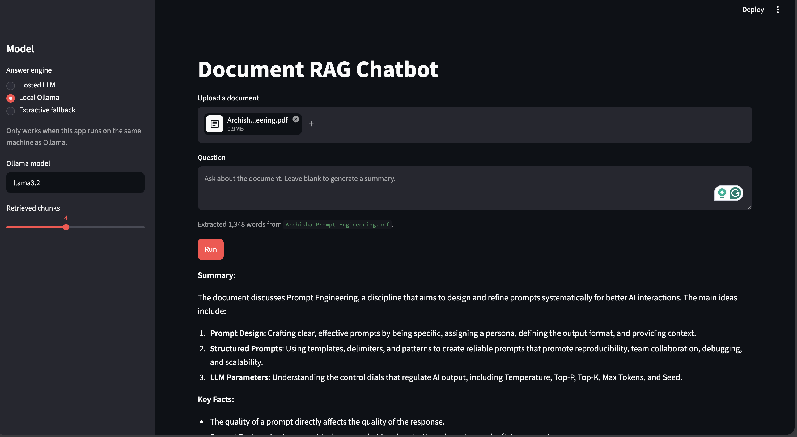

# AI Chatbot Swecha Task

Deployed Streamlit app: https://ai-chatbot-swecha-task-mk2zd9y3cybe9sorzlbnvh.streamlit.app/

This project is a Streamlit RAG chatbot. Users upload a PDF, TXT, or Markdown
document, and the app retrieves relevant chunks from that document to answer
questions. If the user leaves the question blank, the app returns a summary.

## What document did you use and why?

The sample document is `data/rag_reference.pdf`. It is a short reference note
about retrieval augmented generation, chunking, embeddings, and hosted model
deployment. I used it because it directly matches the concepts demonstrated by
the app and gives predictable test questions for the RAG workflow.

The app also supports user-uploaded documents, so the bundled PDF is mainly a
submission artifact and demo document.

## How does your chunking work?

The loader splits extracted document text into overlapping word chunks. The
default chunk size is 160 words with a 35-word overlap. The overlap helps keep
important context from being lost when an answer spans a chunk boundary.

The chunking code lives in `utils/loader.py`.

## Which embedding model did you use?

The app uses a lightweight local TF-IDF embedding approach implemented in
`utils/embedder.py`. Each chunk is tokenized, converted into a normalized TF-IDF
vector, and compared with the user's query using cosine similarity.

This keeps the app easy to deploy without needing a vector database or a paid
embedding endpoint. For answer generation, the public deployment can use a
hosted OpenAI-compatible model through Groq when `GROQ_API_KEY` is configured in
Streamlit Secrets.

## How to run locally

Create and activate a virtual environment:

```bash
python3 -m venv .venv
.venv/bin/python -m pip install -r requirements.txt
```

Run the Streamlit app:

```bash
.venv/bin/streamlit run app.py
```

Optional local secrets file:

```bash
mkdir -p .streamlit
cp .streamlit/secrets.toml.example .streamlit/secrets.toml
```

Then paste your real Groq key into `.streamlit/secrets.toml`.

For local Ollama demos, choose **Local Ollama** in the sidebar and use an
installed model such as `llama3.2`. Ollama mode only works on the same machine
where Ollama is running.

## Screenshot



## What would you improve with more time?

- Add a stronger hosted embedding model for semantic retrieval.
- Add persistent chat history per uploaded document.
- Store document chunks in a vector database such as FAISS or Chroma.
- Add OCR support for scanned PDFs.
- Add clearer evaluation tests with multiple real PDFs.
- Add source highlighting so users can see exactly where each answer came from.
